# COVID-19 Analysis Dashboard

> **Python, PostgreSQL ve Power BI ile hazırlanmış uçtan uca COVID-19 veri analizi projesi.**
>
> Ülkelerin COVID-19 vaka, ölüm, hastane, test, aşılama ve demografik göstergelerini temizler, analiz eder ve etkileşimli bir Power BI dashboard'unda sunar.

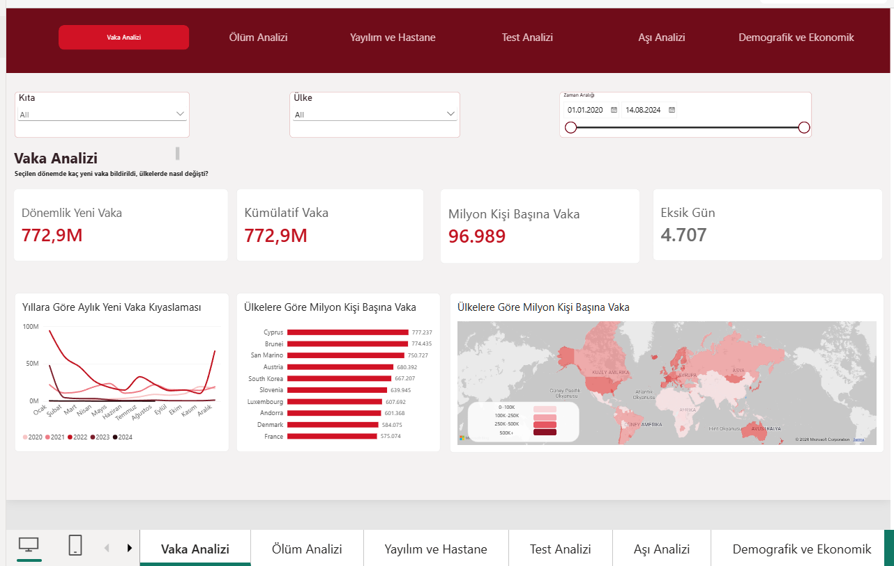

## Proje özeti

Bu proje COVID-19 verisini ülke düzeyinde iki ölçekte inceler:

| Ölçek | Ne anlatır? |
|---|---|
| **Mutlak değerler** | Toplam vaka, toplam ölüm ve belirli dönemdeki yeni kayıtlar |
| **Nüfusa göre değerler** | Milyon kişi başına vaka, ölüm, hastane ve yoğun bakım yükü |

Bu ayrım önemlidir. Büyük nüfuslu ülkeler toplam sayılarda öne çıkabilir; milyon kişi başına değerler kullanıldığında ülke sıralaması değişebilir. Dashboard'daki Kıta, Ülke ve Tarih filtreleri bütün sayfalarda bu karşılaştırmayı daraltır.

## Öne çıkan bulgular

| Konu | Kısa bulgu | Ayrıntı |
|---|---|---|
| Vaka | Toplam vakada ABD, Çin ve Hindistan öne çıkar; nüfusa göre hesaplama sıralamayı değiştirir. | [Vaka analizi](notebooks/cases_analysis.ipynb) |
| Ölüm | Büyük nüfuslu ülkeler toplam ölümde öne çıkar; milyon kişi başına ölçü farklı ülkeleri öne taşır. | [Ölüm analizi](notebooks/deaths_analysis.ipynb) |
| Yayılım | R > 1 yayılımın artma eğiliminde olduğunu gösterir. R serisi kaynakta 02.01.2023'te biter. | [Yayılım ve hastane](notebooks/spread_hospital_analysis.ipynb) |
| Test | Farklı test birimleri aynı ölçü değildir. Ülkeler arası sıralamada yalnızca yapılan test sayısı kullanılır. | [Test analizi](notebooks/testing_analysis.ipynb) |
| Aşı | Eksik aşı kaydı sıfır kabul edilmez; Türkiye'de aşı oranları 2021 boyunca yükselip sonra yataylaşır. | [Aşı analizi](notebooks/vaccination_analysis.ipynb) |
| Demografi | Yaşlı nüfus oranı ile milyon kişi başına ölüm arasında pozitif ilişki görülür; bu nedensellik değildir. | [Demografik analiz](notebooks/demographic_economic_analysis.ipynb) |

## Notebook rehberi

| Dosya | Amaç | Analizde öne çıkan nokta |
|---|---|---|
| [data_audit_cleaning.ipynb](notebooks/data_audit_cleaning.ipynb) | Ham veriyi denetler, konumları ayırır ve temiz ülke tablosunu üretir. | Tekrar eden ülke-tarih kayıtları çelişki yoksa dolu değerler korunarak tekilleştirilir. |
| [cases_analysis.ipynb](notebooks/cases_analysis.ipynb) | Vaka, haftalık değişim, eksik gün ve milyon kişi başına vaka analizi yapar. | Eksik gün sıfır sayılmaz; tam olmayan haftalar ülkeler arası karşılaştırmaya girmez. |
| [deaths_analysis.ipynb](notebooks/deaths_analysis.ipynb) | Ölüm serilerini ve nüfusa göre ölüm yükünü inceler. | Kümülatif ölümdeki kaynak düzeltmeleri korunur; eksik günler sıfırla doldurulmaz. |
| [spread_hospital_analysis.ipynb](notebooks/spread_hospital_analysis.ipynb) | R değeri, önlem sıkılığı, hastane ve yoğun bakım yükünü inceler. | Hastane/YBÜ verisi yalnızca kayıt paylaşan ülkeler için yorumlanır. |
| [testing_analysis.ipynb](notebooks/testing_analysis.ipynb) | Test kapsamı, test birimi ve pozitiflik oranını inceler. | Yapılan test, test edilen kişi ve örnek sayısı aynı ölçü değildir. |
| [vaccination_analysis.ipynb](notebooks/vaccination_analysis.ipynb) | Aşı dozları ve aşılanma oranlarını vaka/ölüm eğrileriyle inceler. | Aşı oranında her ülkenin son geçerli değeri kullanılır. |
| [demographic_economic_analysis.ipynb](notebooks/demographic_economic_analysis.ipynb) | Demografik ve ekonomik göstergeler ile COVID-19 yükü ilişkisini inceler. | Her nokta bir ülkeyi temsil eder; korelasyon neden-sonuç kanıtı değildir. |

## Notebook Bulgular?

### Veri Denetimi ve Temizlik

- Veri setindeki konumlar; ana analiz ülkeleri, bölgeler/özel statülü konumlar, kıtalar, gelir grupları ile Dünya ve Avrupa Birliği toplamları olarak ayrıldı.
- Western Sahara, Faroe Islands ve Birleşik Krallık alt bölgeleri gibi ülke olarak değerlendirilmemesi gereken konumlar `df_regions` içinde tutuldu.
- `location` ve `date` sütunlarına göre tekrar eden kayıtlar bütün veri gruplarında kontrol edildi.
- East Timor, Faroe Islands, gelir grupları ve Avrupa Birliği toplamlarında tekrar eden tarihli kayıtlar bulundu.
- Tekrar eden kayıtların aynı tarih ve sütunda çelişkili dolu değerler içerip içermediği kontrol edildi.
- Çelişkili değer bulunmadığı için tekrar eden kayıtlar, her sütundaki boş olmayan değer korunarak tekilleştirildi.
- Tekilleştirme sonrasında tüm veri gruplarında kalan `location + date` tekrarı kontrol edildi.
- Her konumun ilk ve son kayıt tarihi, kayıtlı gün sayısı ve bu aralıktaki eksik gün sayısı hesaplandı.
- Northern Cyprus için 5 Aralık 2022 tarihinde bir günlük kayıt eksikliği tespit edildi.
- Eksik tarih, sıfır vaka veya sıfır ölüm olarak yorumlanmadı; veri kalitesi notu olarak korundu.
- Temizlenmiş veri dosyalarını kaydedildi.

Bu veri denetimi aşamasında yalnızca yapısal sorunlar incelendi. Sütun bazındaki eksik değerler, ilgili analiz notebook'larında değişkenin anlamına göre ayrıca değerlendirilecektir.

### Vaka ve ölüm yükü: mutlak değer ile nüfusa göre ölçü farklıdır

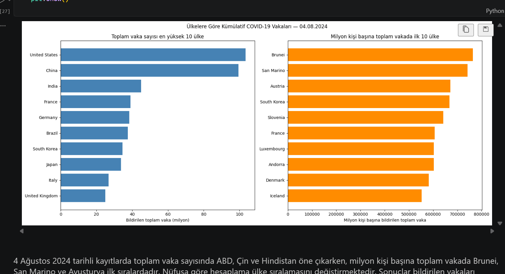
#### Türkiye'de vaka eğrileri

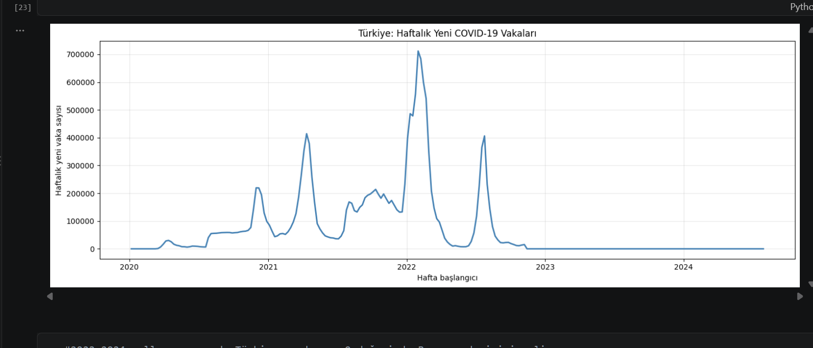

Türkiye'de haftalık yeni vaka sayısı 2022 başında en yüksek seviyeye ulaşır. 2023 sonrasında serinin sıfıra yaklaşması, bu dönemde düzenli vaka bildiriminin sona erdiğini gösterir; sıfır vaka anlamına gelmez.

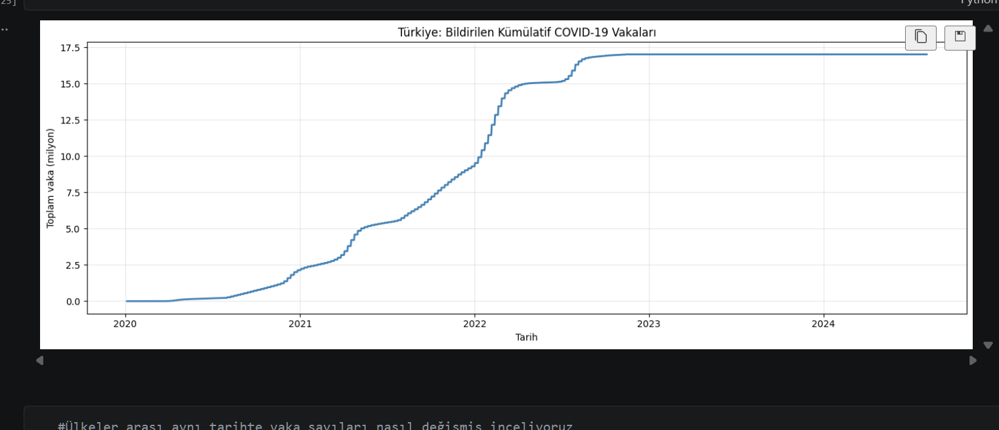

Kümülatif vaka eğrisi yalnızca yukarı yönlü ilerler. Eğrinin dikleştiği dönemler, yeni vaka bildirimlerinin hızlandığı dalgalardır.

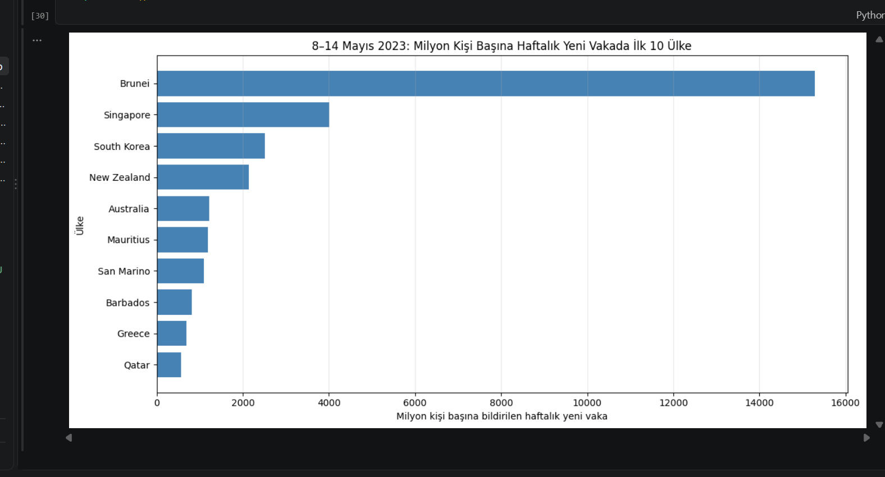

8–14 Mayıs 2023 haftasında Brunei başta olmak üzere küçük nüfuslu ülkeler milyon kişi başına haftalık vakada üst sıradadır. Bu görsel, toplam sayı ile nüfusa göre ölçünün farklı sıralamalar ürettiğini gösterir.


> **Nasıl hesapladık?** Günlük vaka sayılarını haftalara topladık. Bir haftada gün eksikse, o haftayı ülkeleri karşılaştırırken kullanmadık.

4 Ağustos 2024 itibarıyla bildirilen toplam vaka sayısında Amerika Birleşik Devletleri, Çin ve Hindistan öne çıkar. Milyon kişi başına hesaplama ise nüfus büyüklüğünün etkisini azaltır ve sıralamayı değiştirebilir. Bu nedenle dashboard'da mutlak değerler ile kişi başına ölçüler birlikte sunulur.

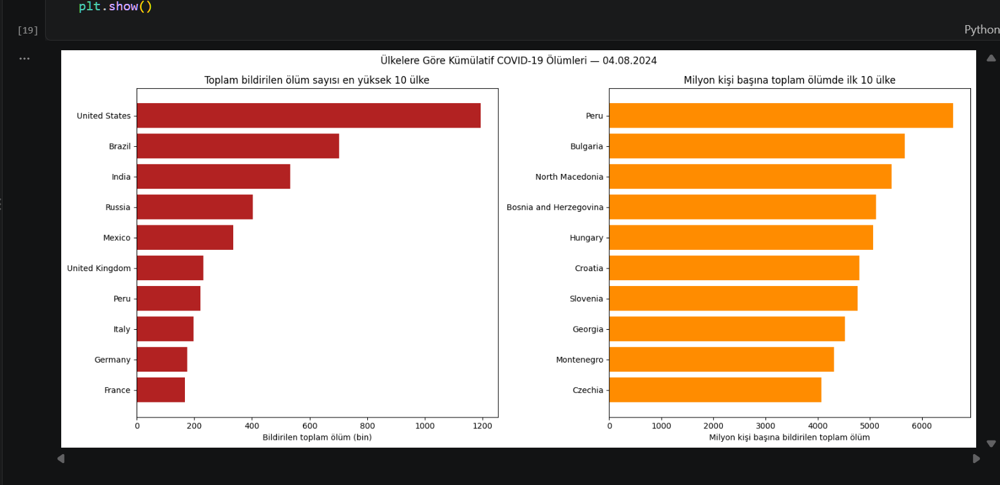
#### Türkiye'de ölüm eğrileri

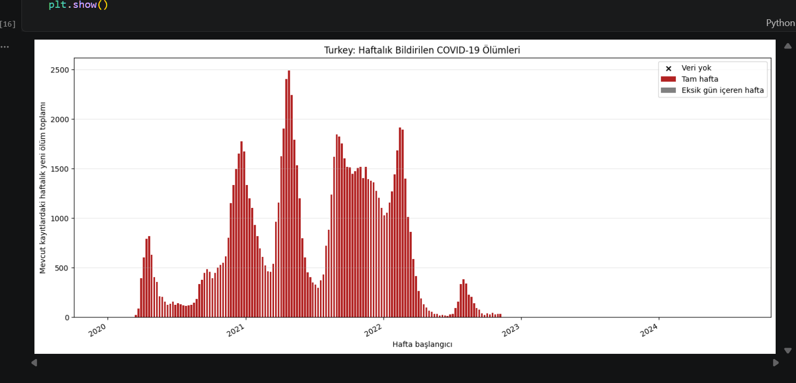

Türkiye'de haftalık yeni ölüm grafiği, tam hafta ve eksik gün içeren haftaları ayırır. En yüksek ölüm dalgaları 2021 ile 2022 başında görülür.

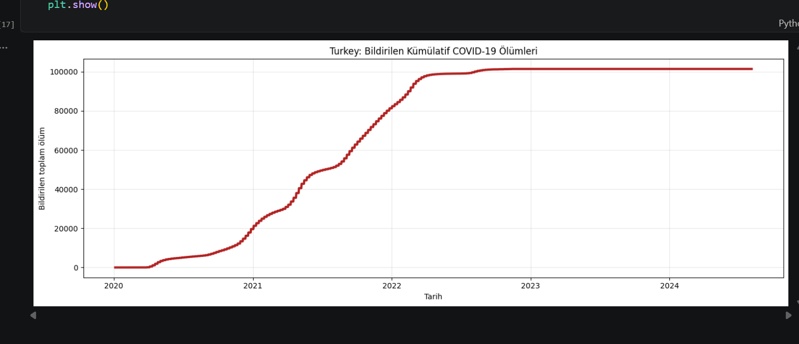

Kümülatif ölüm eğrisindeki hızlı yükselişler salgın dalgalarıyla ilişkilidir. Son dönemdeki yataylaşma, bildirilen ölüm sayısındaki artışın azalmasını gösterir.

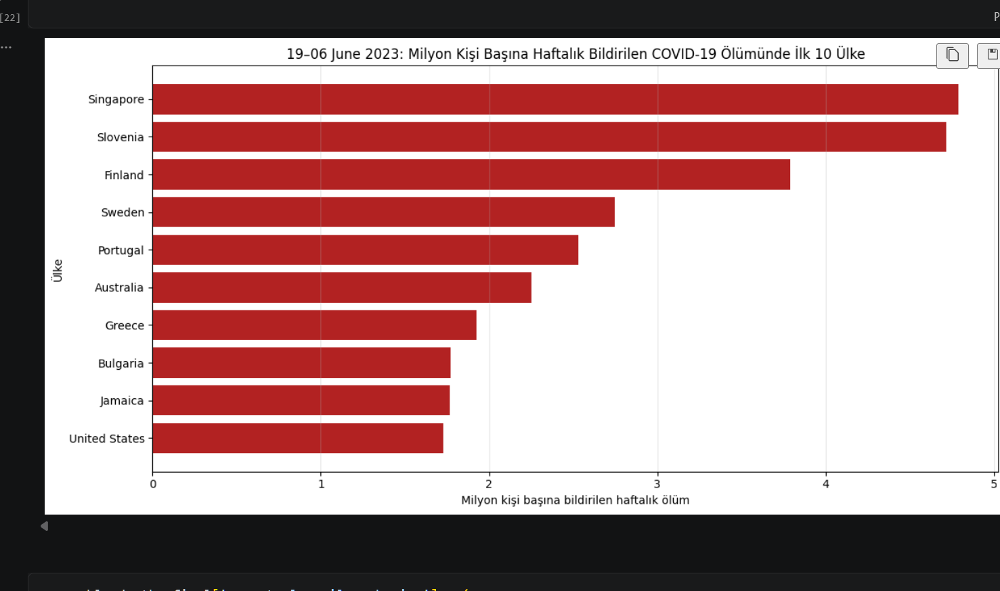

19–25 Haziran 2023 haftasında milyon kişi başına yeni ölüm sıralaması, toplam ölüm sayısından farklı ülkeleri öne çıkarır. Bu nedenle ölüm yükünü nüfusa göre de incelemek gerekir.


> **Nasıl hesapladık?** Eksik günleri sıfır ölüm gibi göstermedik. Haftalık değişimi yalnızca verisi tam olan iki hafta arasında hesapladık.

Aynı ayrım ölüm verisinde de görülür. Mutlak bildirilen ölüm sayısında büyük nüfuslu ülkeler öne çıkarken, milyon kişi başına ölüm sıralaması Peru, Bulgaristan ve Kuzey Makedonya gibi farklı ülkeleri öne taşır. Bu görseller bildirilen sonuçları gösterir; veri kapsamı ve raporlama farklılıkları nedeniyle tek başına salgın yönetiminin başarısını ölçmez.

#### Vaka notebook'unun ayrıntılı bulguları

Vaka Analizinde Yapılan İşlemler ve Bulgular
- Temizlenmiş ülke verileri kullanıldı. Veri setinde 194 ülkeye ait 324.819 satır ve 67 sütun bulunduğu görüldü. Tarihler 1 Ocak 2020–14 Ağustos 2024 aralığındadır.
- Ülke–tarih tekrarları kontrol edildi. Temizlenmiş ülke tablosunda tekrar eden ülke–tarih kaydı bulunmadı.
- total_cases sütunundaki eksik kayıtlar incelendi. Kısmen eksik verisi bulunan ülkelerde boşlukların ilk dolu kayıttan önce veya son dolu kayıttan sonra bulunduğu görüldü.
- Kümülatif vaka sayısındaki azalmalar kontrol edildi. 16 ülke–tarih kaydında total_cases değerinin önceki kayda göre azaldığı tespit edildi.
- Azalma tarihlerindeki günlük vaka kayıtları incelendi. Bu 16 kaydın tamamında new_cases değerinin boş olduğu görüldü. Bu durum, boş değerlerin azalmaya neden olduğunu kanıtlamaz. Azalmaların nedeni doğrulanmadığı için kaynak değerler korundu.
- new_cases sütunundaki eksikler sınıflandırıldı. Başlangıçta, veri akışının ortasında ve sonda bulunan boşluklar ayrıldı. 16 ülkede dolu kayıtların arasında birer günlük boşluk bulundu.
- Negatif günlük yeni vaka değerleri kontrol edildi. Yapılan kontrolde negatif new_cases kaydı bulunmadı.
- Haftalık yeni vaka toplamları oluşturuldu. Günlük kayıtlar pazartesi–pazar dönemlerine ayrıldı ve mevcut günlük vaka değerleri toplandı. Tamamen boş haftaların toplamı NaN olarak korundu.
- Haftaların veri kapsamı belirlendi. Her hafta için kayıtlı gün, dolu gün ve eksik gün sayıları hesaplandı. Yedi günlük vaka verisi dolu olan haftalar “tam hafta” olarak işaretlendi.
- Eksik haftaların gösterim kuralı belirlendi. Eksik haftalarda mevcut günlerin toplamının, eksiklik açıklamasıyla birlikte gösterilmesine karar verildi. Hiç dolu kaydı olmayan haftalar “Veri yok” olarak etiketlendi.
- Haftalık değişim hesaplandı. Artış ve azalışlar yalnızca birbirini izleyen iki tam hafta arasında hesaplandı. Önceki haftanın toplamı sıfır olduğunda yüzde değişim hesaplanmadı.
- Nüfus bilgisi kontrol edildi. Eksik, sıfır veya negatif nüfus değeri bulunmadı. Aynı ülke içinde farklı nüfus değerine rastlanmadı.
- Milyon kişi başına haftalık yeni vaka hesaplandı. Ülkelerin nüfus farklarını hesaba katmak için haftalık vaka toplamı nüfusa bölünüp bir milyonla çarpıldı. Son tablodaki bu gösterge yalnızca tam haftalar için tutuldu.
- Türkiye’nin haftalık ve kümülatif vaka eğilimleri incelendi. Son dönemde yeni vakaların çoğunlukla sıfır olması, kümülatif toplamın yaklaşık 17 milyon seviyesinde yatay ilerlemesiyle uyumlu bulundu. Bu durum gerçek vaka oluşumunun tamamen durduğunu göstermez.
- 4 Ağustos 2024 tarihli ülke karşılaştırması yapıldı. Toplam vakada ABD, Çin ve Hindistan; milyon kişi başına toplam vakada Brunei, San Marino ve Avusturya ilk üç sırada yer aldı. Nüfusa göre hesaplama ülke sıralamasını değiştirdi.
- Ortak hafta için veri kapsamı incelendi. 8–14 Mayıs 2023 haftasında 194 ülkenin tamamında yedi günlük yeni vaka kaydı doluydu. Bu hafta için milyon kişi başına yeni vaka karşılaştırması hazırlandı. Dolu kayıtların bulunması, raporlamanın güncel olduğunu tek başına kanıtlamaz.
- Hafta sonundaki kümülatif vaka değerleri eklendi. Her ülkenin pazar günündeki total_cases değeri alındı. Kümülatif değerler haftalık olarak toplanmadı; pazar değeri bulunamadığında eksik bırakıldı.
- Dashboard için haftalık çıktı tablosu hazırlandı. Mevcut vaka toplamı, veri kapsamı, haftalık değişimler, nüfusa göre vaka değeri ve hafta sonu kümülatif toplamı aynı tabloda birleştirildi.


#### Ölüm notebook'unun ayrıntılı bulguları

- Temizlenmiş ülke verileri kullanıldı. Analizde yalnızca ülkeler yer aldı; ülke-tarih tekrarları temizlenmiş veri dosyasında bulunmamaktadır.

- `total_deaths` sütununun veri kapsamı incelendi. Kısmen eksik kümülatif ölüm kayıtlarındaki boşluklar veri akışının başında veya sonunda bulunmuştur. Dolu ölüm kayıtlarının arasında eksik `total_deaths` kaydı tespit edilmemiştir.

- Kümülatif ölüm sayısındaki azalmalar kontrol edildi. 9 ülke-tarih kaydında `total_deaths` değerinin önceki kayda göre azaldığı görüldü.

- Kümülatif ölümün azaldığı 9 tarihin tamamında `new_deaths` değeri eksikti. Bu birliktelik, eksik günlük ölüm kaydının azalmanın nedeni olduğunu kanıtlamaz. Azalmaların kaynak düzeltmesi veya veri sorunu olup olmadığı doğrulanmadığı için kaynak değerler korundu.

- `new_deaths` sütunundaki eksik kayıtlar başta, arada ve sonda olarak sınıflandırıldı. Australia, Canada, Chile, China, Indonesia, Panama, Papua New Guinea, Sierra Leone ve Thailand için dolu kayıtların arasında birer günlük eksik ölüm kaydı bulundu.

- Negatif `new_deaths` kaydı bulunmadı.

- Günlük yeni ölüm kayıtları pazartesi–pazar dönemlerine göre haftalık olarak gruplandı. Her ülke ve hafta için mevcut ölüm toplamı, dolu gün sayısı ve eksik gün sayısı hesaplandı.

- Tam haftalar, eksik gün içeren haftalar ve hiç veri bulunmayan haftalar `veri_durumu` sütunuyla etiketlendi. Eksik haftalarda yalnızca mevcut günlerin toplamı korundu; bu değer tam haftanın toplamı gibi yorumlanmadı.

- Haftalık ölüm farkı ve yüzde değişimi yalnızca birbirini izleyen iki tam hafta için hesaplandı. Önceki haftanın ölüm toplamı sıfır olduğunda yüzde değişimi boş bırakıldı.

- Haftalık ölüm değerleri milyon kişi başına hesaplandı. Eksik haftalardaki mevcut gün toplamı ile yalnızca tam haftalara ait güvenilir karşılaştırma değeri ayrı sütunlarda tutuldu.

- Her haftanın pazar günündeki `total_deaths` değeri hafta sonu kümülatif ölüm olarak eklendi. Kümülatif ölüm değerleri haftalık olarak toplanmadı.

- Türkiye için haftalık bildirilen ölüm ve kümülatif ölüm eğrileri incelendi. Eksik haftalar grafikte ayrı işaretlenebilecek biçimde hazırlandı.

- 4 Ağustos 2024 tarihinde toplam bildirilen ölüm sayısında ABD, Brezilya ve Hindistan; milyon kişi başına toplam ölümde Peru, Bulgaristan ve Kuzey Makedonya ilk sıralarda yer aldı. Nüfusa göre hesaplama ülke sıralamasını değiştirmektedir.

- Ortak hafta için veri kapsamı incelendi. 19–25 Haziran 2023 haftasında 194 ülkenin tamamında yedi günlük ölüm verisi bulundu. Bu hafta için milyon kişi başına haftalık ölüm karşılaştırması hazırlandı.

- Dashboard için `weekly_deaths.csv` tablosu oluşturuldu. Bu tablo; mevcut ölüm toplamı, veri durumu, haftalık değişim, milyon kişi başına değerler ve hafta sonu kümülatif ölüm bilgisini içerir.

- Fazla ölüm verisi, dashboard planında yer almadığı için bu projenin analiz kapsamına alınmadı.

### Yayılım ve hastane yükü

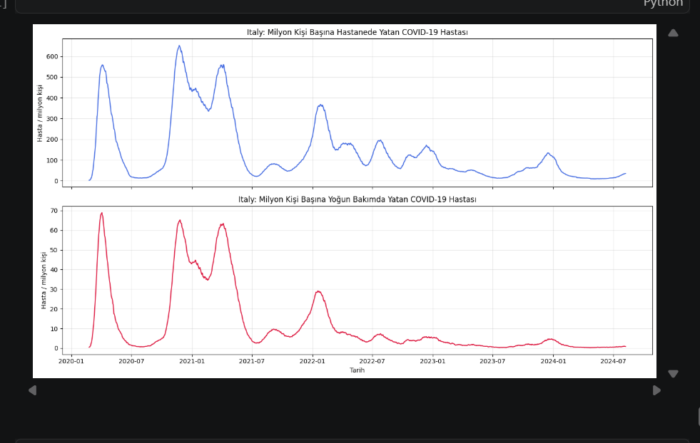
#### Yayılım ve hastane için ek görseller

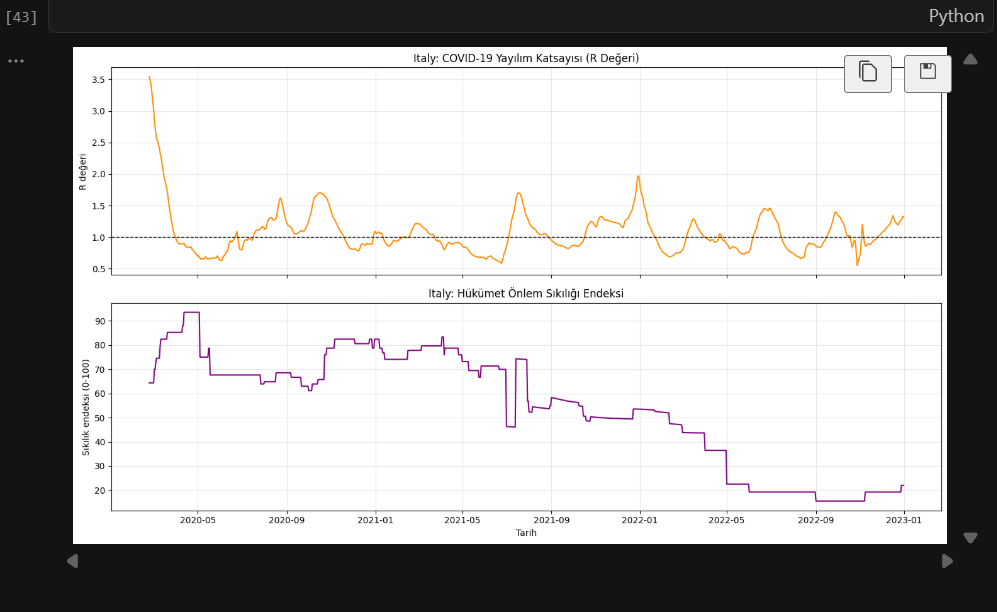

İtalya örneğinde R değeri ile önlem sıkılığı aynı zaman ekseninde görülür. R değerinin 1 çizgisinin üstünde olması yayılımın artma eğiliminde olduğunu gösterir; bu grafik tek başına önlemlerin etkisini kanıtlamaz.

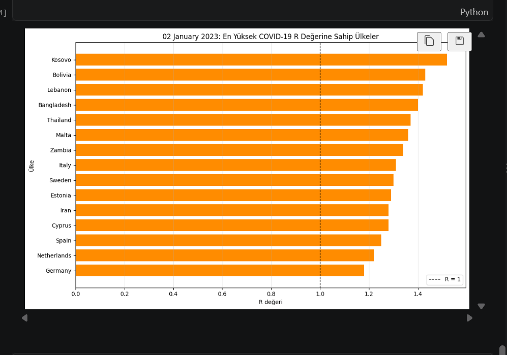

2 Ocak 2023 tarihinde Kosova, Bolivya ve Lübnan en yüksek R değerleri arasındadır. Kesikli çizgi R = 1 eşiğini gösterir.

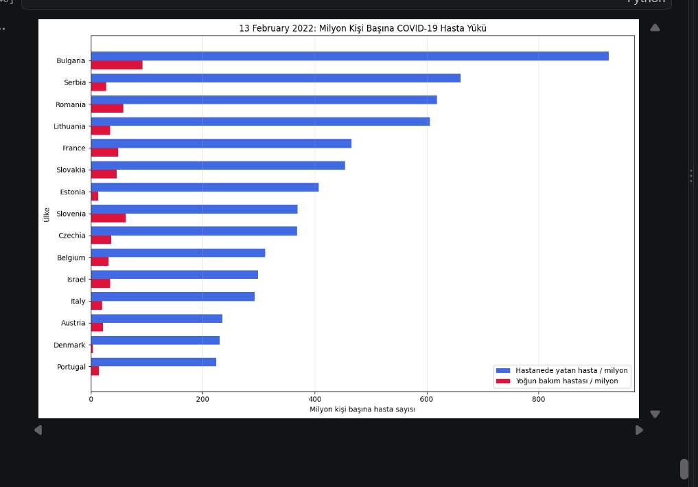

13 Şubat 2022'de Bulgaristan, Sırbistan ve Romanya hastanede yatan kişi sayısında öne çıkar. Hastane ve yoğun bakım yükleri milyon kişi başına gösterildiği için ülkeler karşılaştırılabilir.


> **Nasıl hesapladık?** Hasta sayılarını ülkelerin nüfusuna göre karşılaştırdık. Veri vermeyen ülkeleri ve boş günleri sıfır kabul etmedik. R değeri verisi 02.01.2023'te bitiyor.

Hastanede ve yoğun bakımda bulunan hasta serileri, belirli bir gündeki yükü gösterir. İtalya örneğinde iki yük göstergesi birlikte dalgalanır; yoğun bakım eğrisi daha düşük düzeyde fakat benzer salgın dalgalarıyla hareket eder. Bu veri yalnızca hastane verisi paylaşan ülkeler için mevcuttur; boş günler sıfır kabul edilmemiştir.

#### Yayılım ve hastane notebook'unun ayrıntılı bulguları

### R değeri ve önlem sıkılığı

- `reproduction_rate`, salgının yayılma hızını gösterir. `R > 1` yayılımın artma, `R < 1` ise yavaşlama eğiliminde olduğunu ifade eder.
- R değeri 191 ülkede bulunmuştur. Her ülkenin R verisinin aktif kayıt aralığında aradaki günler eksiksizdir.
- R verisi kaynakta çoğunlukla 2 Ocak 2023 sonrasında bulunmadığı için R grafikleri bu tarih sonrasını kapsamamaktadır.
- 2 Ocak 2023 tarihinde 191 ülkenin R değeri birlikte bulunduğundan, ülkeler arası R karşılaştırması bu tarih üzerinden yapılmıştır.
- `stringency_index`, hükümetlerin okul/iş yeri kapanmaları, seyahat kısıtları ve benzeri önlemlerinin sıkılığını 0–100 aralığında gösterir.
- İtalya örneğinde R değeri ve önlem sıkılığı 24 Şubat 2020–31 Aralık 2022 arasında birlikte incelenmiştir.
- Bazı dönemlerde daha yüksek önlem sıkılığı ile daha düşük R değeri birlikte gözlense de bu durum nedensellik kanıtlamaz. Aşılama, varyantlar, test kapasitesi, davranış değişiklikleri ve önlemlerin gecikmeli etkisi de salgının yayılımını etkiler.

## Hastane ve Yoğun Bakım Yükü

- `hosp_patients` ve `icu_patients`, belirli bir tarihte hastanede ve yoğun bakımda bulunan COVID-19 hasta sayılarını gösterir.
- Hastane hasta verisi 36 ülkede, yoğun bakım hasta verisi 38 ülkede bulunmuştur. Her iki göstergeyi birlikte paylaşan ülke sayısı 32’dir.
- Bazı ülkelerde hastane veya yoğun bakım verisinin aktif tarih aralığında boş günler bulunmaktadır. Bu boşluklar sıfır ile doldurulmamıştır.
- Hastane ve yoğun bakım verisi aktif döneminde kesintisiz olan 16 ülke belirlenmiştir. Uzun dönem zaman grafikleri için bu ülkeler tercih edilmelidir.
- İtalya; hastane ve yoğun bakım verisinin aynı tarih aralığında, 24 Şubat 2020–7 Ağustos 2024 arasında kesintisiz olması nedeniyle örnek zaman grafiği için kullanılmıştır.
- Ülkeler arası karşılaştırmada ham hasta sayısı yerine `hosp_patients_per_million` ve `icu_patients_per_million` kullanılmıştır. Böylece nüfus büyüklüğünün karşılaştırmayı yanıltması önlenmiştir.
- Milyon kişi başına değerler, ham hasta sayısı ve nüfus üzerinden yapılan hesaplamalarla tutarlıdır.
- 13 Şubat 2022 tarihinde 30 ülkenin hem hastane hem yoğun bakım verisi birlikte bulunmuştur. Bu tarihte Bulgaristan, milyon kişi başına hastane ve yoğun bakım hasta yükünde en yüksek ülkeler arasında yer almıştır.
- Bulgaristan’daki yüksek hastane yükü, Ocak sonu ve Şubat 2022’deki yüksek vaka ve ölüm yüküyle aynı döneme denk gelmektedir. Ancak bu durum tek başına sağlık sistemi kapasitesi veya tek bir faktörle açıklanamaz.

### Haftalık yatış ve yatak kapasitesi göstergeleri

- `weekly_hosp_admissions` ve `weekly_icu_admissions`, kaynak tarafından bildirilen haftalık hastane ve yoğun bakım yatış göstergeleridir.
- Bu göstergeler yalnızca sınırlı sayıda ülkede bulunur ve ülkeler arasında günlük veya haftalık farklı kayıt sıklıklarıyla paylaşılmıştır.
- Bu nedenle haftalık yatış göstergeleri yeniden toplanmamış, ana ülkeler arası karşılaştırmada kullanılmamıştır. Gerekirse seçili ülke detayında kaynak tarafından bildirilen değer olarak gösterilebilir.
- `hospital_beds_per_thousand`, bin kişi başına hastane yatağı kapasitesini gösteren sabit bir ülke bilgisidir. Günlük zaman serisi olarak değil, ülke bağlam göstergesi olarak kullanılacaktır.

### Dashboard Kararları

- R değeri için ülke karşılaştırması ve seçili ülke zaman grafiği sunulabilir; veri kapsamının 2023 başında bittiği belirtilmelidir.
- Hastane ve yoğun bakım zaman grafikleri yalnızca yeterli ve kesintisiz veri bulunan ülkeler için gösterilmelidir.
- Ülke karşılaştırmalarında milyon kişi başına hastane ve yoğun bakım göstergeleri kullanılmalıdır.
- Veri bulunmayan günler sıfır kabul edilmeyecek, grafiklerde boşluk olarak korunacaktır.
- Bu bölüm için ayrı bir işlenmiş CSV oluşturulmasına gerek yoktur; dashboard günlük göstergeleri `countries_clean.csv` dosyasından kullanabilir.

### Test verisinin yorumu

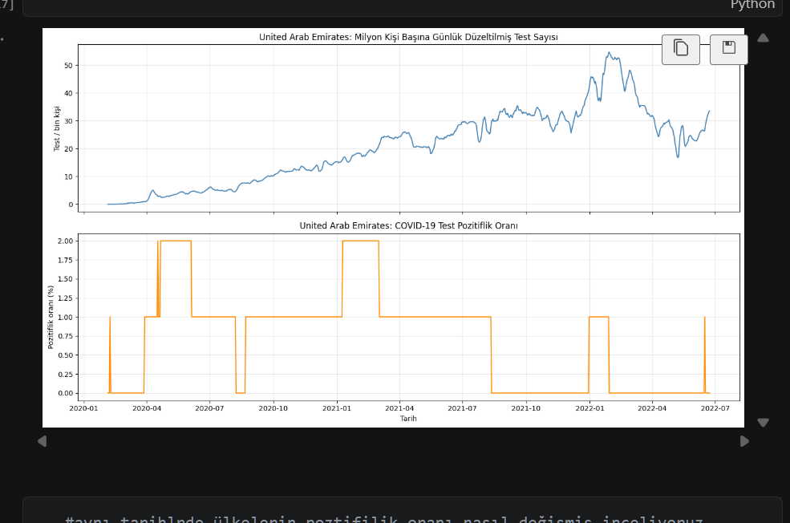
#### Pozitiflik oranı karşılaştırması

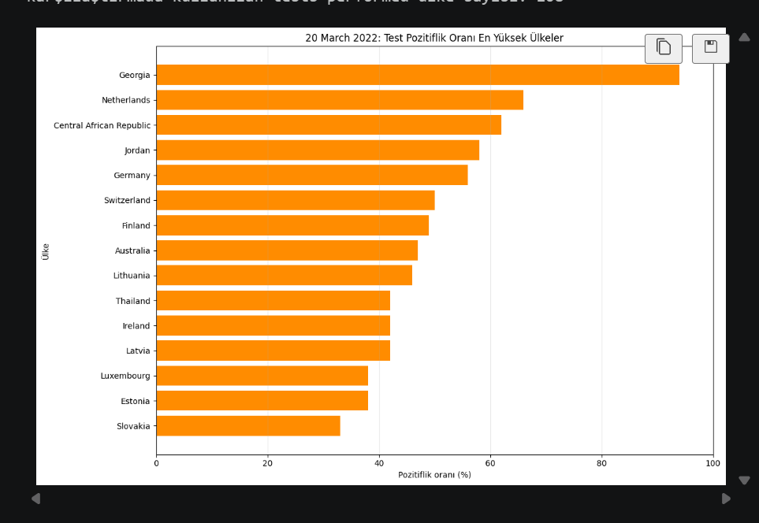

20 Mart 2022'de en yüksek pozitiflik oranları Gürcistan ve Hollanda'da görülür. Pozitiflik oranı test yoğunluğu ve raporlama kapsamıyla birlikte yorumlanmalıdır.


> **Nasıl hesapladık?** Ülkeleri adil karşılaştırmak için sadece yapılan test sayısını bildiren ülkeleri kullandık. Eksik günleri doldurmadık.

Test yoğunluğu ve pozitiflik oranı her ülkede aynı sıklıkta bildirilmez. Bu örnek, test serisindeki değişimleri ve pozitiflik bildirimindeki kesintileri görünür kılar. Ülkeler arası test karşılaştırmalarında yalnızca `tests performed` birimi kullanan ülkeler değerlendirilir; kişi ya da örnek sayısı olarak bildiren veriler aynı ölçeği temsil etmez.

#### Test notebook'unun ayrıntılı bulguları

### Veri kapsamı ve test birimleri

- `total_tests` 172 ülkede, `new_tests` 142 ülkede, `new_tests_smoothed` 169 ülkede ve `positive_rate` 162 ülkede bulunmaktadır.
- Test birimi bilgisi 176 ülkede vardır.
- 138 ülke `tests performed`, 23 ülke `people tested`, 14 ülke `samples tested` ve 1 ülke `units unclear` test birimini kullanmaktadır.
- Hiçbir ülkede zaman içinde birden fazla test birimi görülmemiştir. Bu nedenle her ülkenin kendi zaman serisinde test ölçüm birimi tutarlıdır.
- Farklı test birimleri aynı ölçümü temsil etmediği için ham `total_tests` ve `new_tests` değerleri bütün ülkeler arasında doğrudan karşılaştırılmamalıdır.

### Toplam ve günlük test verisi

- `total_tests` kümülatif test sayısında azalış görülmemiştir. Test verisi bulunan dönemlerde kümülatif toplamlar mantıksal olarak artmaktadır.
- `total_tests` ve `new_tests` boşluklarının çoğu veri serisinin başlangıç veya bitiş döneminde bulunur. Aktif raporlama dönemindeki boşluklar sınırlıdır.
- `new_tests` alanında negatif değer bulunmamıştır.
- `new_tests` verisi bulunan 142 ülkenin 122’sinde kayıtlar çoğunlukla günlük aralıklarla paylaşılmıştır.
- Daha seyrek raporlama yapan veya yalnızca az sayıda test kaydı bulunan ülkeler de vardır. Bu nedenle haftalık test toplamları yalnızca 7 günün tamamında `new_tests` verisi bulunan haftalar için hesaplanmıştır.
- Eksik gün içeren haftalar sıfırla doldurulmamış, `tam_hafta` ve `veri_durumu` alanlarıyla etiketlenmiştir.

### Pozitiflik oranı ve test/vaka oranı

- `positive_rate` değerlerinin tamamı 0–1 aralığındadır; mantıksal sınır dışında değer bulunmamıştır.
- Pozitiflik oranı eksikliklerinin çoğu raporlamanın başlangıç veya bitiş dönemindedir. Aktif dönem içindeki boşluklar sınırlı olduğundan seçili ülke zaman grafikleri için uygundur.
- `tests_per_case` alanında sıfır veya negatif değer bulunmamıştır.
- Seçili ülke örneğinde bazı dönemlerde test yoğunluğu düşerken pozitiflik oranı yükselmiştir. Bu durum testlerin daha çok riskli kişilere uygulanması, test kapasitesi veya artan bulaş ile ilişkili olabilir; grafik tek başına nedensellik göstermez.

### Ülkeler arası karşılaştırma ve dashboard

- Pozitiflik oranı, ham test sayısına göre ülkeler arasında daha uygun bir karşılaştırma göstergesidir.
- En fazla ortak pozitiflik oranı bulunan tarih 20 Mart 2022’dir; bu tarihte 136 ülkenin pozitiflik oranı bulunmaktadır.
- Karşılaştırma grafiğinde yalnızca `tests performed` kullanan 107 ülke kullanılmıştır.
- Seçili ülke zaman grafiğinde milyon kişi başına düzeltilmiş test yoğunluğu ile pozitiflik oranı ayrı panellerde gösterilmiştir.
- Dashboard için `weekly_tests.csv` tablosu oluşturulmuştur. Haftalık test kartı yalnızca `tam_hafta = True` olan kayıtlarda kullanılmalıdır.
- Test birimi, veri durumu ve son gözlem tarihi dashboard’da kullanıcıya gösterilmelidir.

### Aşılama, vaka ve ölüm eğrileri

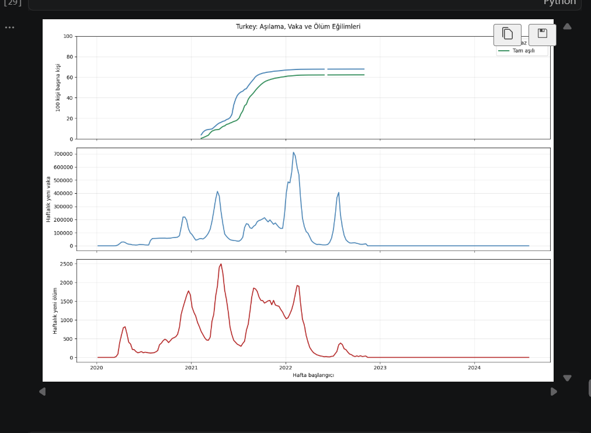
#### Aşı kapsamı ve ilerleyişi

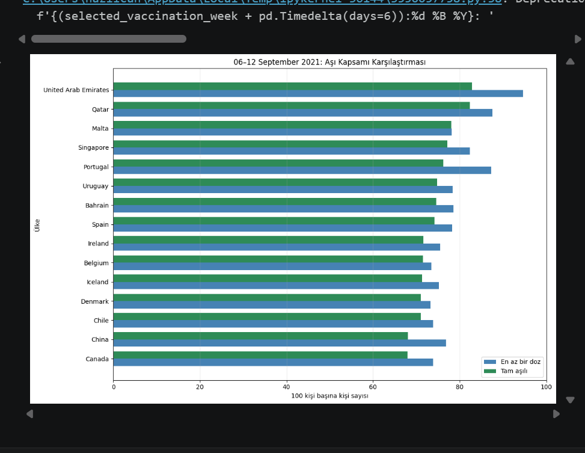

6–12 Eylül 2021 haftasında Birleşik Arap Emirlikleri ve Katar en az bir doz ile tam aşılı oranlarında üst sıradadır. Mavi çubuk en az bir doz, yeşil çubuk tam aşılı oranını gösterir.

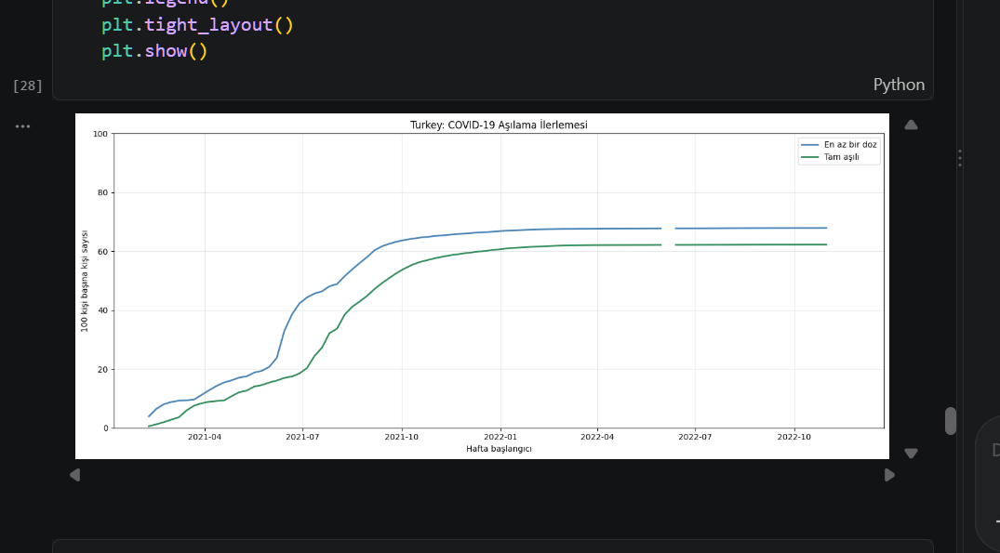

Türkiye'de en az bir doz ve tam aşılı oranı 2021 boyunca yükselir, ardından yataylaşır. Serideki boşluklar veri eksikliğidir; sıfır aşılama değildir.


> **Nasıl hesapladık?** Her hafta için ülkelerin en güncel aşı oranını aldık. Veri yoksa o haftayı boş bıraktık; sıfır aşı yapılmış gibi göstermedik.

Türkiye'de en az bir doz ve tam aşılama oranı 2021 boyunca yükselmiş, daha sonra yataylaşmıştır. Vaka ve ölüm eğrileriyle aynı zaman ekseninde gösterim, dönemlerin birlikte nasıl değiştiğini açıklar. Bu görsel nedensel bir aşı etkisi kanıtı değildir; varyantlar, test düzeyi, yaş yapısı ve raporlama gibi etkenler ayrıca rol oynar.

#### Aşı notebook'unun ayrıntılı bulguları

- Temizlenmiş ülke verileri kullanıldı. Aşı analizi, `countries_clean.csv` içindeki ülke bazlı kayıtlara dayanır.

- Toplam doz, en az bir doz olan kişi, tam aşılı kişi, booster ve aşı oranı sütunlarının ülke bazındaki veri kapsamı incelendi.

- Tam aşılama oranı verisinin birçok ülkede günlük ve kesintisiz yayımlanmadığı görüldü. Eksik kayıtlar başlangıçta, veri akışının arasında ve sonunda bulunabilmektedir.

- Eksik aşı oranları sıfırla doldurulmadı. Boş kayıt, o gün hiç aşılama yapılmadığı şeklinde yorumlanmadı.

- Negatif toplam doz, ilk doz kişi, tam aşılı kişi veya booster kaydı bulunmadı.

- Tam aşılı kişi sayısının en az bir doz olmuş kişi sayısını geçtiği mantıksal olarak çelişkili kayıt bulunmadı.

- `total_vaccinations`, `people_vaccinated`, `people_fully_vaccinated` ve `total_boosters` sütunlarında zaman içinde azalma tespit edilmedi.

- Günlük düzenli kayıt şartı yerine, her ülke için haftalık aşı gözlem tablosu oluşturuldu.

- Her haftada hem ilk doz hem tam aşılama oranının birlikte bulunduğu son kayıt `gozlem_tarihi` olarak seçildi. Bu gözlemin hafta sonuna göre gecikmesi `gozlem_gecikmesi_gun` sütununda tutuldu.

- Bir haftada iki aşı oranı birlikte bulunmuyorsa oranlar boş bırakıldı ve `veri_durumu` alanında “Aşı oranı verisi yok” olarak işaretlendi.

- Ortak haftada ilk doz ve tam aşılama oranları ülkeler arasında karşılaştırıldı. Karşılaştırmada yalnızca iki oranı da bulunan ülkeler kullanıldı.

- Türkiye için aşılama oranı, haftalık yeni vaka ve haftalık yeni ölüm eğrileri aynı zaman ekseninde gösterildi. Bu grafikler zaman içindeki beraber değişimi gösterir; tek başına nedensel etki kanıtlamaz.

- Dashboard için `weekly_vaccinations.csv` tablosu oluşturuldu. Tablo; haftalık aşı oranlarını, gerçek gözlem tarihini, gözlem gecikmesini ve veri durumunu içerir.

### Demografik ve ekonomik ilişkiler

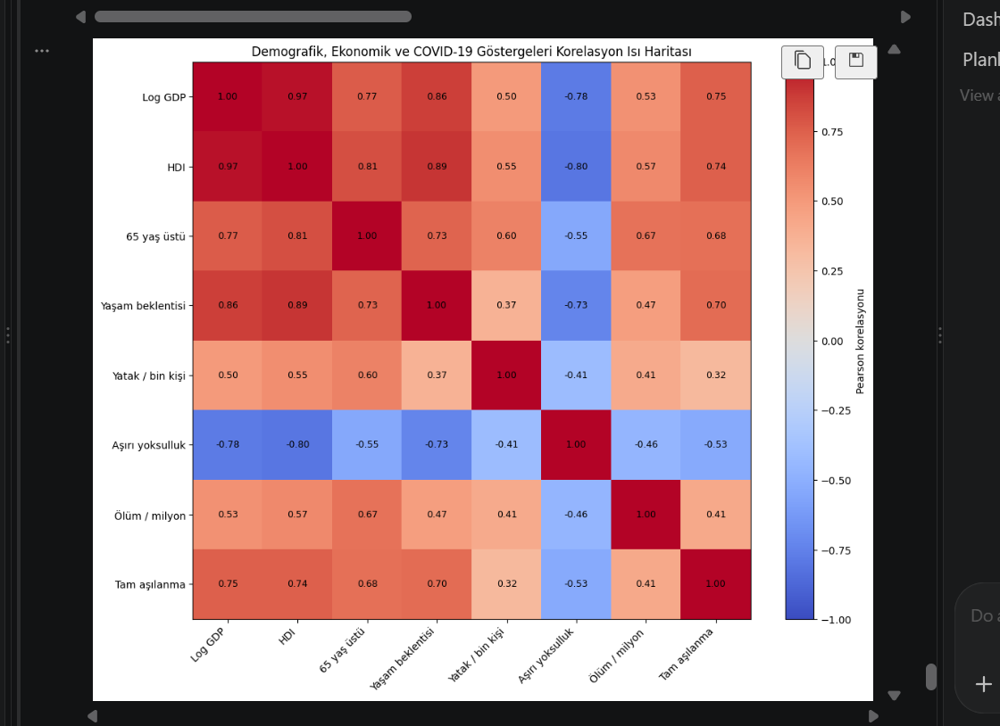
#### Demografik dağılım grafikleri

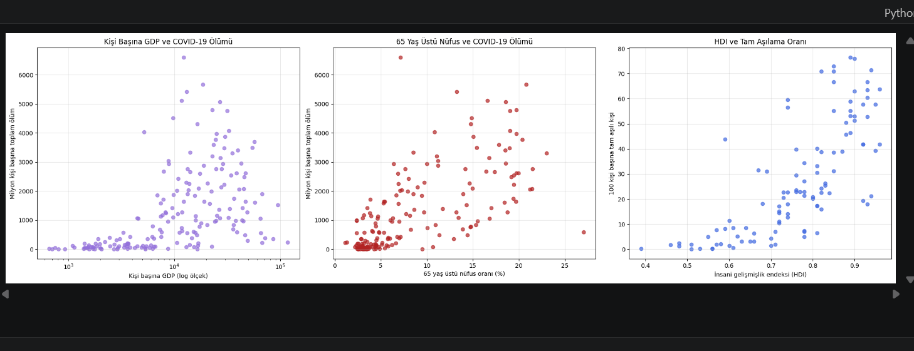

Bu üç dağılım grafiği kişi başı GSYH, 65 yaş üstü nüfus ve HDI ile milyon kişi başına ölüm arasındaki ilişkiyi gösterir. Her nokta bir ülkedir; noktaların yoğunlaşması benzer değerlere sahip daha fazla ülke olduğunu anlatır.


> **Nasıl hesapladık?** Her ülkeyi tek bir profil ile karşılaştırdık. Bir bilgi eksikse o ülkeyi yalnızca ilgili grafikten çıkardık. Bu grafikler ilişkiyi gösterir, neden-sonuç göstermez.

Ülke düzeyindeki korelasyon analizinde log kişi başı GSYH ile milyon kişi başına ölüm arasında orta düzeyde pozitif ilişki görüldü (`r = 0.498`, 186 ülke). 65 yaş üstü nüfus oranı ile milyon kişi başına ölüm ilişkisi daha güçlüydü (`r = 0.683`, 182 ülke). HDI ile tam aşılama oranı arasında da güçlü pozitif ilişki vardı (`r = 0.741`, 105 ülke). Bu ilişkiler nedensellik göstermez; birlikte değişen sosyal, demografik ve raporlama faktörleri sonuçları etkileyebilir.

#### Demografik ve ekonomik notebook'unun ayrıntılı bulguları

### Veri kalitesi ve ülke profili

- Demografik, ekonomik, sağlık riski ve altyapı göstergeleri ülke bazında sabit bilgiler olarak incelenmiştir.
- Sabit göstergelerde zaman içinde birden fazla farklı değer ve tanımlanan mantıksal sınırların dışında anormal kayıt bulunmamıştır.
- Her ülke için tek satırlık `country_profile` tablosu oluşturulmuştur.
- Bir ülkenin bir göstergesi eksikse, ülke yalnızca o göstergenin kullanıldığı analizden çıkarılmıştır. Tüm göstergeleri eksik olmadığı sürece ülke analizden tamamen çıkarılmamıştır.

### Ölüm ve aşılanma karşılaştırmaları

- Milyon kişi başına toplam COVID-19 ölümü için en geniş ortak kapsam, 4 Ağustos 2024 tarihinde 194 ülkede bulunmuştur.
- Tam aşılama oranı için en geniş ortak kapsam, 16 Ağustos 2021 tarihinde 106 ülkede bulunmuştur.
- Ölüm ve aşılama göstergeleri için farklı tarihler kullanılmıştır; her gösterge kendi en geniş ülke kapsamına sahip tarihte değerlendirilmiştir.

### Ana ilişkiler

- Logaritmik kişi başına GDP ile milyon kişi başına toplam COVID-19 ölümü arasında orta düzeyde pozitif ilişki görülmüştür (`r = 0.498`, 186 ülke).
- 65 yaş üstü nüfus oranı ile milyon kişi başına toplam COVID-19 ölümü arasında güçlü pozitif ilişki görülmüştür (`r = 0.683`, 182 ülke).
- HDI ile tam aşılama oranı arasında güçlü pozitif ilişki görülmüştür (`r = 0.741`, 105 ülke).
- HDI düzeyi yüksek ülkelerde tam aşılama oranları genel olarak daha yüksektir. Bu ilişki; sağlık altyapısı, gelir, lojistik kapasite ve aşı erişimi gibi birlikte değişen faktörleri yansıtabilir.

### Yardımcı göstergeler

- Ortanca yaş ve 70 yaş üstü nüfus oranı da milyon kişi başına toplam ölümle güçlü pozitif ilişki göstermiştir.
- Kadın sigara oranı, el yıkama imkânı ve yaşam beklentisi bazı ülkelerde ölüm göstergesiyle pozitif ilişki göstermiştir. Bu sonuçlar doğrudan nedensel etki olarak yorumlanmamalıdır.
- Aşırı yoksulluk oranı ile bildirilen COVID-19 ölümü arasında negatif ilişki görülmüştür. Ülkeler arası raporlama farkı, yaş yapısı, sağlık hizmetine erişim ve gelişmişlik düzeyi bu ilişkiyi etkileyebilir.
- Diyabet yaygınlığı ve logaritmik nüfus yoğunluğu ile milyon kişi başına toplam ölüm arasında çok zayıf ilişki görülmüştür.

### Korelasyon ısı haritası

- Korelasyon ısı haritasında GDP, HDI, yaşlı nüfus oranı ve yaşam beklentisinin birbiriyle güçlü ilişkiler taşıdığı görülmüştür.
- Isı haritasında tüm seçili göstergeleri eksiksiz bulunan 69 ülke kullanılmıştır.
- Korelasyonlar ülke düzeyindeki birliktelikleri gösterir; bireysel risk, nedensel etki veya politika başarısı olarak yorumlanmamalıdır.

### Dashboard Kararları

- Dashboard’da GDP–ölüm, 65 yaş üstü nüfus–ölüm ve HDI–tam aşılama için üç dağılım grafiği kullanılacaktır.
- Korelasyon ısı haritası, seçili demografik ve ekonomik göstergelerin birlikte incelenmesi için kullanılacaktır.
- Grafiklerde her nokta bir ülkeyi temsil eder.
- Regression veya tahmin modeli bu projenin kapsamına alınmamıştır.

## Dashboard Görselleri

### Vaka Analizi


Bu sayfa, seçilen dönemde vaka sayılarının nasıl değiştiğini gösterir.

- **Dönemlik Yeni Vaka:** Seçilen tarihlerde bildirilen yeni vakaların toplamı.
- **Kümülatif Vaka:** Her ülkenin ulaştığı son toplam vaka sayısı.
- **Milyon Kişi Başına Vaka:** Toplam vakanın ülke nüfusuna göre karşılaştırılmış hâli.
- **Eksik Gün:** Yeni vaka bilgisi olmayan gün sayısıdır; sıfır vaka anlamına gelmez.

Aylık çizgi grafik salgın dalgalarını, çubuk grafik ülkeleri nüfusa göre karşılaştırır, harita ise yükün ülkeler arasındaki dağılımını gösterir.

### Ölüm Analizi

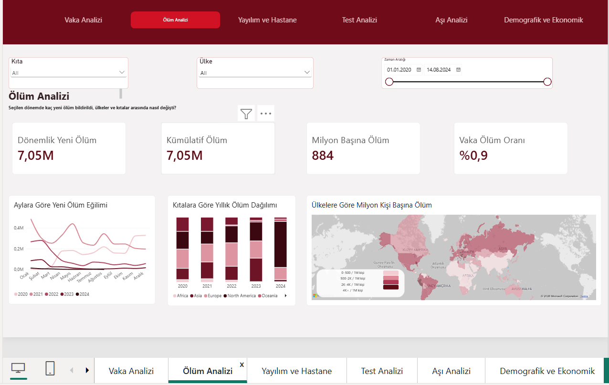

Bu sayfa, seçilen dönemdeki ölüm yükünü vaka sayılarıyla birlikte yorumlamaya yardım eder.

- **Dönemlik Yeni Ölüm:** Seçilen tarihlerdeki yeni ölüm toplamı.
- **Kümülatif Ölüm:** Her ülkenin son bildirilen toplam ölüm değeri.
- **Milyon Başına Ölüm:** Ölüm yükünün nüfusa göre karşılaştırılmış hâli.
- **Vaka Ölüm Oranı:** Kümülatif ölümün kümülatif vakaya oranı.

Çizgi grafik yıllara göre aylık ölümleri, sütun grafik kıtalardaki dağılımı, harita ise nüfusa göre ölüm yükünü gösterir.

### Yayılım ve Hastane

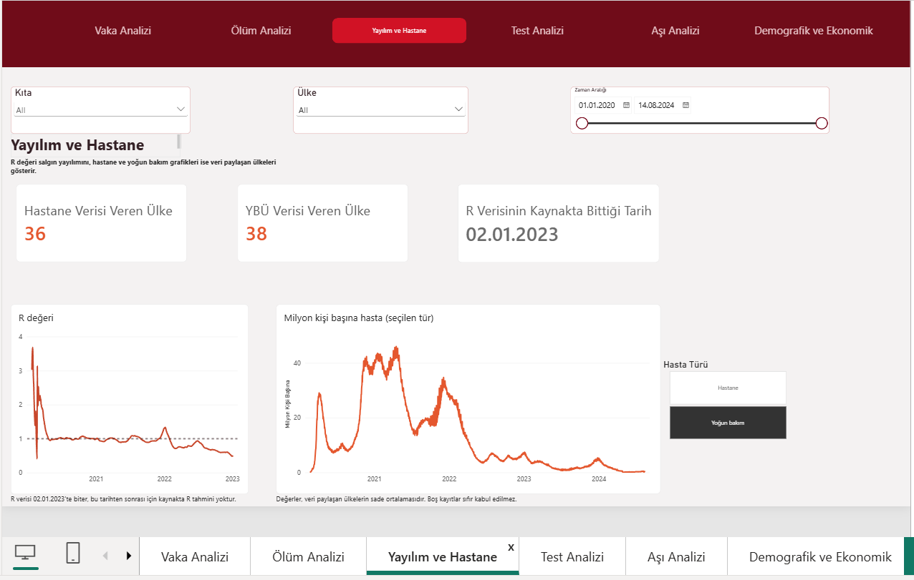

Bu sayfa, salgının yayılma hızını ve sağlık sistemi üzerindeki yükü birlikte gösterir.

- **R Değeri:** Bir hastanın ortalama kaç kişiye hastalığı bulaştırdığını gösterir. R 1'in üzerindeyse yayılım artma eğilimindedir.
- **Hastane / YBÜ Verisi Veren Ülke:** Bu alanlarda en az bir kayıt paylaşan ülke sayısıdır.
- **R Verisinin Kaynakta Bittiği Tarih:** R değerinin son bulunduğu gündür.

Hastane/YBÜ seçim kutusundan gösterilecek hasta türü seçilir. Grafik, veri paylaşan ülkelerin milyon kişi başına günlük ortalamasını verir.

### Test Analizi

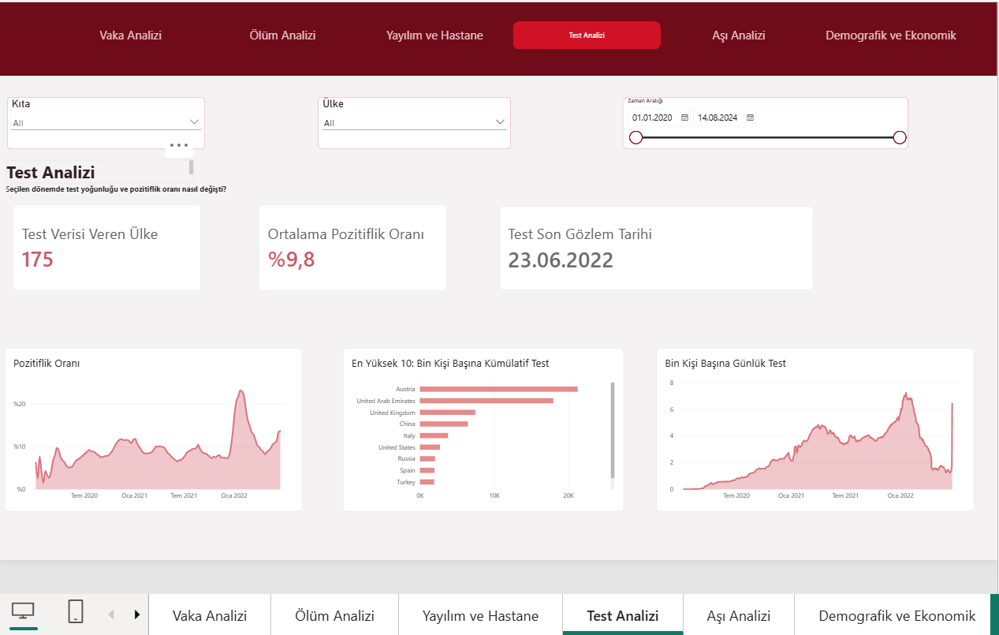

Bu sayfa, test yoğunluğu ve pozitiflik oranını inceler.

- **Test Verisi Veren Ülke:** En az bir toplam test kaydı bulunan ülke sayısı.
- **Ortalama Pozitiflik Oranı:** Veri paylaşan ülkelerdeki pozitiflik oranlarının ortalaması.
- **Test Son Gözlem Tarihi:** Test verisinin kaynakta son bulunduğu tarih.

Çubuk grafik bin kişi başına kümülatif testte ilk 10 ülkeyi gösterir. Test karşılaştırmasına yalnızca aynı birimde, yani yapılan test sayısı olarak veri bildiren ülkeler girer.

### Aşı Analizi

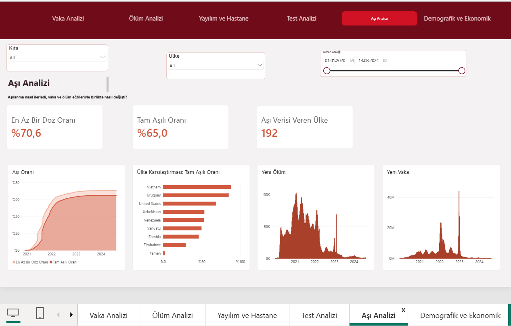

Bu sayfa, aşılanmanın zaman içindeki ilerleyişini yeni vaka ve ölüm eğrileriyle birlikte gösterir.

- **En Az Bir Doz Oranı:** Nüfusa göre en az bir doz aşı olanların oranı.
- **Tam Aşılı Oranı:** Nüfusa göre tam aşılı kişilerin oranı.
- **Aşı Verisi Veren Ülke:** En az bir aşı kaydı paylaşan ülke sayısı.
- **Yeni Vaka / Yeni Ölüm:** Seçilen tarihlerdeki toplam yeni vaka ve ölüm sayıları.

Aşı oranında her ülkenin o tarihe kadarki son bilinen değeri kullanılır. Böylece o gün veri paylaşmayan ülkeler yüzünden oran yapay olarak düşmez.

### Demografik ve Ekonomik Analiz

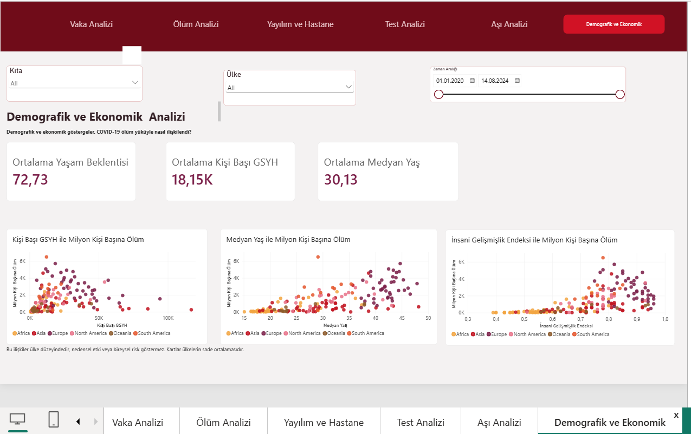

Bu sayfa, ülkelerin demografik ve ekonomik göstergeleri ile milyon kişi başına ölüm yükü arasındaki ilişkiyi gösterir.

- **Ortalama Yaşam Beklentisi, Kişi Başı GSYH ve Medyan Yaş:** Seçilen ülkelerin ortalama değerleri.
- Her nokta bir ülkeyi, renkler ise kıtaları temsil eder.
- Grafiklerde GSYH, medyan yaş ve insani gelişmişlik endeksi ile ölüm yükü birlikte incelenir.

Bu noktaların yakın veya uzak olması ilişkiyi anlatır; tek başına bir göstergenin ölümlere neden olduğunu kanıtlamaz.

## Veri Kaynağı

Veri, [Our World in Data COVID-19 veri sayfasından](https://ourworldindata.org/coronavirus) alınır. Our World in Data tarafından üretilen veri ve görselleştirmeler, atıf koşuluyla CC BY lisansındadır; üçüncü taraf kaynaklı alanların kendi lisansları ayrıca kontrol edilmelidir.

## Proje Akışı

```text
Ham veri → veri denetimi ve temizleme → haftalık / analiz tabloları
        → PostgreSQL sorguları → Power BI dashboard
```

## SQL ile veri doğrulama ve analiz yaklaşımı

SQL, Python ile hazırlanan temiz ve haftalık tabloların PostgreSQL içinde kontrol edilmesi ve tekrar analiz edilmesi için kullanılır. Sorguların tamamı [sql/03_analysis_queries.sql](sql/03_analysis_queries.sql) dosyasındadır.

### Tablo yapısı

- [01_create_schema.sql](sql/01_create_schema.sql), proje tablolarını ayrı bir COVID şemasında tutar.
- [02_create_tables.sql](sql/02_create_tables.sql), günlük temiz ülke verisi ile haftalık vaka, ölüm, test ve aşı tablolarını oluşturur.
- Günlük countries_clean tablosunda location + date birincil anahtardır. Böylece aynı ülke ve tarih için ikinci bir kayıt eklenemez.
- Haftalık tablolarda eksik gün, dolu gün, tam hafta ve veri durumu alanları korunur. Böylece analizde hangi kayıtların güvenle karşılaştırıldığı görülür.

### Önce kontrol, sonra karşılaştırma

SQL sorguları önce kayıt sayısını, ülke sayısını, tarih aralığını, tekrar eden kayıtları ve her değişkenin veri kapsamını kontrol eder. Bu adım, notebook'ta hazırlanan temiz tabloların PostgreSQL'e doğru aktarıldığını doğrular.

Haftalık sonuçlarda yalnızca tam hafta verisi kullandık. Bir ülkede haftanın bir günü eksikse o ülke o haftanın küresel toplamına katılmaz. Bu nedenle “en yüksek küresel hafta” sonuçları, tüm ülkelerin değil **tam veri bildiren ülkelerin kaydedilen toplamını** gösterir.

### Vaka ve ölüm sorgularında izlenen yol

- Vaka ve ölüm için önce en yüksek küresel haftalar bulundu.
- Aynı haftada ülkelerin dünya toplamındaki payı hesaplandı.
- Mutlak toplamların yanında milyon kişi başına değerler de sıralandı; böylece nüfus etkisi azaltıldı.
- Çok küçük ülkelerin aşırı değerlerle sıralamayı bozmasını azaltmak için bazı zirve karşılaştırmalarında nüfusu en az 1 milyon olan ülkeler kullanıldı.
- Çin'in Aralık 2022'deki sıra dışı vaka haftası önce tek başına incelendi, ardından Çin hariç küresel karşılaştırma yapıldı.
- Şili ve Ekvador'daki ani ölüm sıçramaları günlük kayıtlarla kontrol edildi.
- Tek haftalık toplu bildirimlerin etkisini azaltmak için ülkelerin 4 haftalık hareketli ortalama ölüm yükü de hesaplandı.

### Test verisi kararı

Test verisinde yapılan test sayısı, test edilen kişi sayısı ve örnek sayısı aynı ölçü değildir. Bu yüzden ham test toplamları bütün ülkeler arasında doğrudan karşılaştırılmadı. Ortak test sıralamalarında yalnızca **yapılan test sayısı** birimini kullanan ülkeler seçildi.

Test ile vakayı doğrudan bölerek bulunan “100 test başına vaka” sonucu bazı ülkelerde 100'ü aşabildi. Test ve vaka bildirimleri aynı kişiyi veya aynı raporlama zamanını temsil etmediği için bu ölçü güvenilir kabul edilmedi. Bunun yerine kaynaktan gelen pozitiflik oranı, günlük test yoğunluğu ve kayıtlı gün sayısı birlikte değerlendirildi.

### Aşı karşılaştırması kararı

Aşı oranları her ülkede her gün yayımlanmadığı için, her hafta ülkenin son geçerli aşı gözlemi kullanıldı. Boş günler sıfır aşılanma olarak yorumlanmadı.

Ülkeler, ortak veri kapsamının yüksek olduğu 6 Eylül 2021 haftasında tam aşılama oranına göre düşük, orta ve yüksek grup olarak ayrıldı. Sonraki 12 haftadaki milyon kişi başına ölüm oranları karşılaştırıldı. Orta kapsama grubunun düşük kapsama grubundan daha yüksek çıkması; yaş yapısı, dalganın zamanı, sağlık sistemi ve eksik bildirim gibi başka etkenlerin sonucu etkilediğini gösterir. Bu analiz nedensellik kanıtı değildir.

## Teknolojiler

- **Python:** veri inceleme, temizlik ve analiz notebook'ları
- **PostgreSQL / SQL:** şema, tablo tanımları ve analiz sorguları
- **Power BI:** etkileşimli rapor, DAX ölçüleri ve filtreler

## Klasör Yapısı

```text
covid-analysis/
├── README.md
├── .gitignore
├── pyproject.toml
├── src/              # data_loader.py
├── notebooks/        # denetim, temizlik ve analiz notebook'ları
├── sql/              # şema ve analiz sorguları
├── dashboard/        # .pbix, tema ve ekran görüntüleri
├── docs/             # ölçüler, doğrulamalar ve metodoloji notları
├── data/             # yalnızca README.md sürüm kontrolünde
└── outputs/          # yerel üretilen tablolar ve görseller
```

## Kurulum ve Çalıştırma

1. Depoyu klonlayın ve Python ortamını oluşturun.
2. Bağımlılıkları `pyproject.toml` üzerinden kurun.
3. Kaynak veriyi `data/raw/` altına yerel olarak indirin.
4. Önce `notebooks/data_audit_cleaning.ipynb` notebook'unu çalıştırın.
5. Diğer notebook'ları analiz sırasına göre çalıştırın.
6. Power BI içinde `dashboard/covid19_dashboard.pbix` dosyasını açın; veri kaynağı yolunu kendi yerel `data/processed/` klasörünüze göre güncelleyin.

Ayrıntılı veri yerleşimi için [data/README.md](data/README.md) dosyasına bakın.

## Önemli Hesaplama Kararları

- Tayvan, Kosova, Hong Kong ve Filistin analizde ayrı ülke birimleri olarak ele alınır. Ülke olarak veri kaynağının ülke olarak listelediği konumlar alınır.
- Eksik gözlemler sıfır kabul edilmez; kartlarda ve grafiklerde boş kalır.
- Haftalık analizlerde tam hafta kuralı uygulanır.
- Kümülatif değerler, ülkeler için son geçerli değerin alınmasıyla hesaplanır; günlük satırlar toplanmaz.
- Oranlar ve kişi başına değerler ülkeler arasında doğrudan toplanmaz; ölçüye uygun ağırlıklı ya da ülke ortalaması yaklaşımı kullanılır.
- Demografik grafikler ülke düzeyindedir; ilişkiler nedensellik kanıtı değildir.

## Sınırlamalar

- R değeri kaynağı 02.01.2023 tarihinde sona erer.
- Hastane ve YBÜ göstergeleri yalnızca veri paylaşan birkaç düzine ülkeyi kapsar.
- Test ve aşı serilerinde bildirim farkları, eksik günler ve geriye dönük düzeltmeler bulunabilir.
- Ülkeler arası karşılaştırmalarda veri kalitesi ile raporlama kapsamı sonuçları etkileyebilir.

## Lisans

Bu proje [MIT License](LICENSE) ile lisanslanmıştır.
